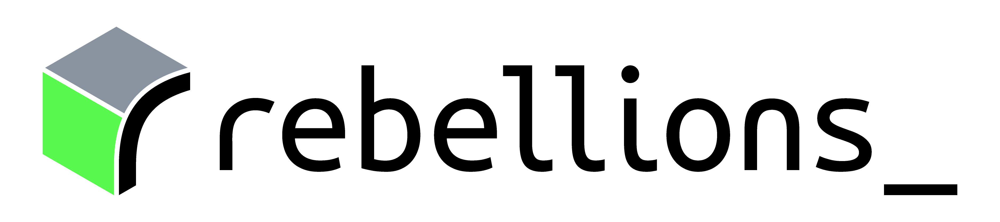

# Optimum RBLN

<div align="center">



[](https://badge.fury.io/py/optimum-rbln)
[](https://github.com/rebellions-sw/optimum-rbln/blob/main/LICENSE)
[](https://docs.rbln.ai/software/optimum/optimum_rbln.html)
[](CODE_OF_CONDUCT.md)


</div>

🤗 Optimum RBLN provides an interface between HuggingFace libraries ([Transformers](https://huggingface.co/docs/transformers), [Diffusers](https://huggingface.co/docs/diffusers/index)) and RBLN NPUs, including [ATOM](https://rebellions.ai/rebellions-product/rbln-ca25/) and [REBEL](https://rebellions.ai/rebellions-product/rebel/).

This library enables seamless integration between the HuggingFace ecosystem and RBLN NPUs through a comprehensive toolkit for model loading and inference across single and multi-NPU environments. While we maintain a list of [officially validated models and tasks](https://docs.rbln.ai/software/optimum/optimum_rbln.html), users can easily adapt other models and tasks with minimal modifications.

## Key Features

🚀 **High Performance Inference**
- Optimized model execution on RBLN NPUs through RBLN SDK compilation
- Support for both single and multi-NPU inference
- Integrated with RBLN Runtime for optimal performance

🔧 **Easy Integration**
- Seamless compatibility with HuggingFace Model Hub
- Drop-in replacement for existing HuggingFace pipelines
- Minimal code changes required for NPU acceleration


## Seamless Replacement for Existing HuggingFace Code

```diff
- from diffusers import StableDiffusionXLPipeline
+ from optimum.rbln import RBLNStableDiffusionXLPipeline

# Load model
model_id = "stabilityai/stable-diffusion-xl-base-1.0"
prompt = "Astronaut in a jungle, cold color palette, muted colors, detailed, 8k"
- pipe = StableDiffusionXLPipeline.from_pretrained(model_id)
+ pipe = RBLNStableDiffusionXLPipeline.from_pretrained(model_id, export=True)

# Generate image
image = pipe(prompt).images[0]

# Save image result
image.save("image.png")

+ # (Optional) Save compiled artifacts to skip the compilation step in future runs
+ pipe.save_pretrained("compiled_sdxl")
```

## Documentation

Check out [the documentation of Optimum RBLN](https://docs.rbln.ai/software/optimum/optimum_rbln.html) for more advanced usage.

## Getting Started

> **Note:** The `rebel-compiler` library, which is required for running `optimum-rbln`, is only available for approved users. Please refer to the [installation guide](https://docs.rbln.ai/getting_started/installation_guide.html) for instructions on accessing and installing `rebel-compiler`.

### Install from PyPI

To install the latest release of this package:
```bash
pip install optimum-rbln

# CPU-only installation (recommended if you don't plan to use CUDA-enabled PyTorch)
pip install optimum-rbln --extra-index-url https://download.pytorch.org/whl/cpu
```

### Install from source

#### Prerequisites

- Install [uv](https://docs.astral.sh/uv/) (refer to [this link](https://docs.astral.sh/uv/getting-started/installation/) for detailed commands)

The below command installs `optimum-rbln` along with its dependencies.

```bash
git clone https://github.com/rebellions-sw/optimum-rbln.git
cd optimum-rbln
./scripts/uv-sync.sh
```

### Need Help?

- Join discussions and get answers in our [Developer Community](https://discuss.rebellions.ai/)
- Contact maintainers at [support@rebellions.ai](mailto:support@rebellions.ai)
